Intégration d'un tableau dans Scribus
=====================================

Introduction
------------

Le logiciel Open Source Scribus est spécialisé dans la PAO (Pagination Assistée par Ordinateur).

On peut le comparer sans problème à QuarkXpress ou Adobe InDesign. Il est très puissant pour mettre en page tout type d'image ou de texte et d'en générer des fichiers imprimables ou des PDF de qualité. Des magazines et des livres professionnels sont réalisés avec Scribus.

Par contre, l'intégration d'un tableau avec une mise en page complexe est réellement problématique. Scribus ne possède pas de fonction évolué de gestion des tableaux.

L'idée est de s'appuyer sur la suite Libre Office pour combler ce manque. Nous allons vous montrer pas à pas les étapes à réaliser pour intégrer un tableau dans Scribus.

Pré-requis
----------

Une machine sous Windows ou Linux avec les logiciels suivant :

- La suite Libre Office : <https://fr.libreoffice.org/>

- Scribus : <https://www.scribus.net/>

Création du tableau sous Calc
-----------------------------

Tout d'abord, il faut réaliser son tableau sous Calc de Libre Office.

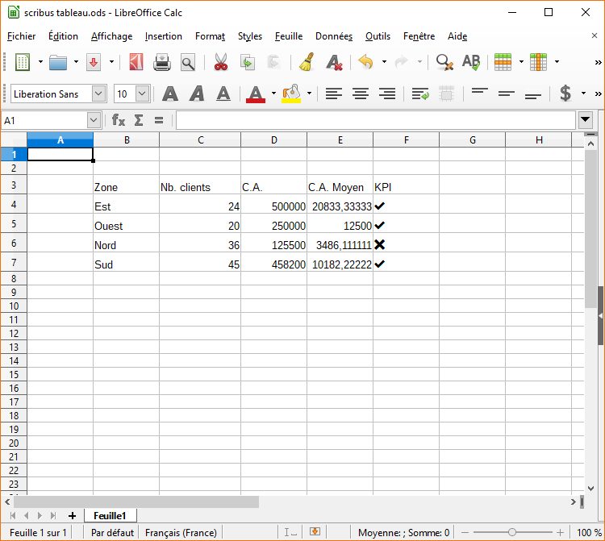

Vous pouvez ajuster toute la mise en page du tableau avec Calc.

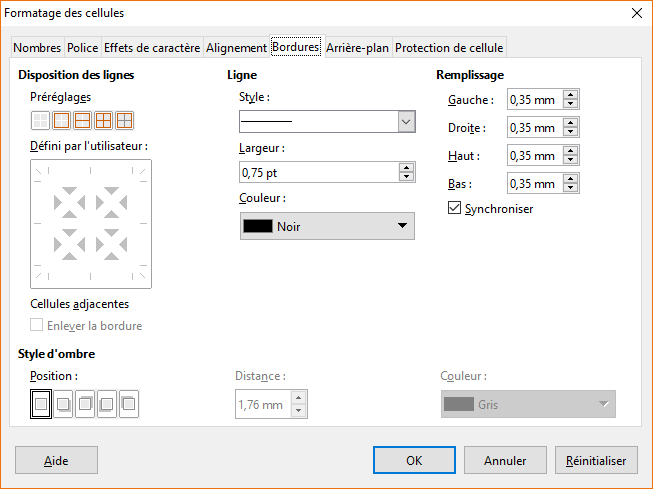

Pour obtenir par exemple, le résultat suivant

Maintenant que vous avez finalisé la mise en page de votre tableau sous Calc. Vous enregistrez bien votre fichier pour ne pas le perdre.
Puis vous sélectionnez et copiez l'ensemble des cellules qui vous intéressent.

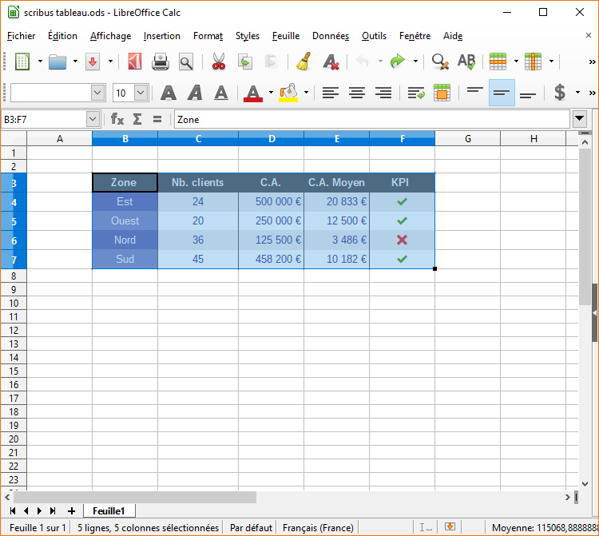

Ensuite vous ouvrez un nouveau document de Dessin (Libre Office Draw)

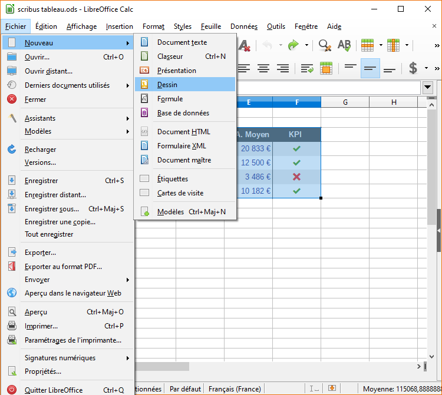

Dans la page vide qui s'est ouverte sous Draw, allez dans le menu Edition &gt; Collage Spécial... pour importer le tableau que vous avez réalisé sous Calc.

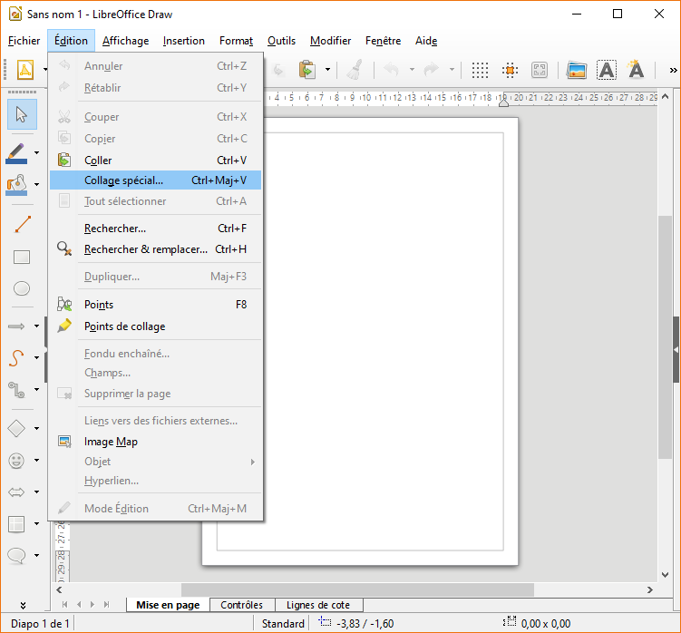

Dans la fenêtre de Collage spécial choisir : Métafichier GDI

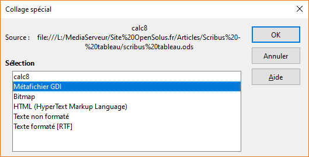

Passage par Draw pour générer le fichier EPS
--------------------------------------------

Vous retrouvez maintenant le tableau que vous avez créé sous Calc directement dans Draw réalisé en éléments vectorisés.

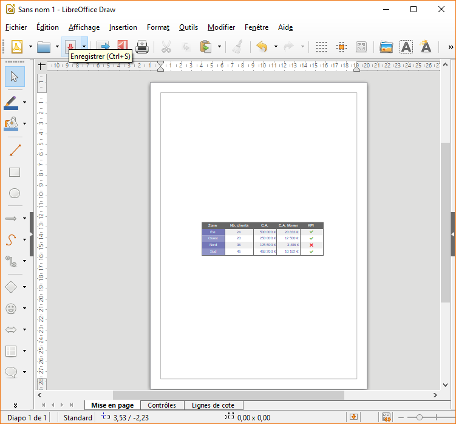

Maintenant nous allons adapter le document Draw au tableau pour qu'il puisse être facilement intégré dans Scribus.
Nous commençons par adapter la taille de la page du document Draw. Allez dans le menu Format &gt; Propriété de la page

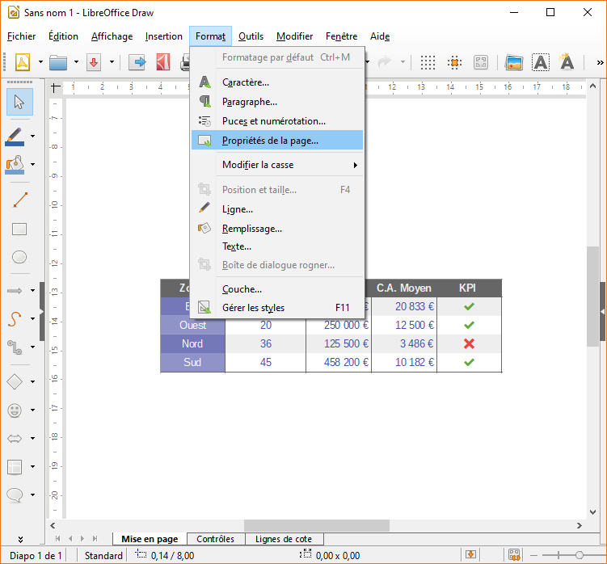

Configurez ensuite les propriétés de la page pour qu'elles correspondent au format de tableau. Ajustez également les marges du document pour qu'elles soient fines tout en étant à l'extérieur du tableau.

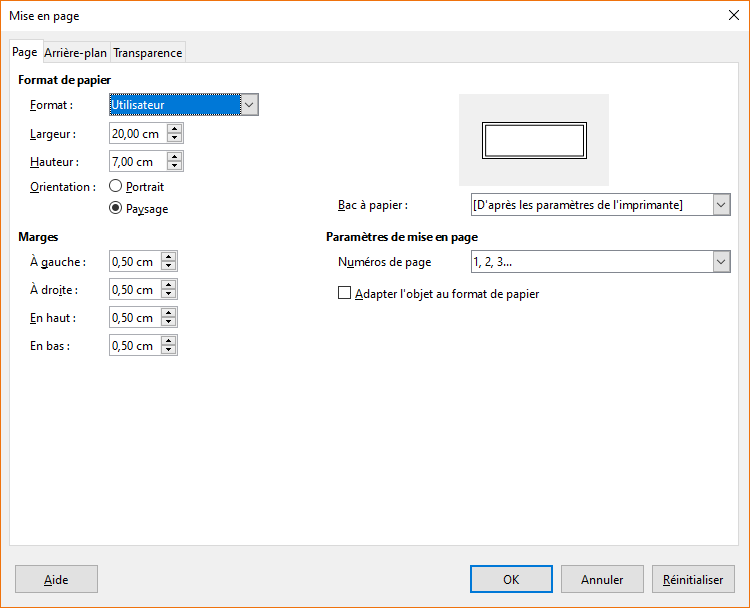

Ensuite, vous pouvez affiner l'ajustement en modifiant la taille du tableau.

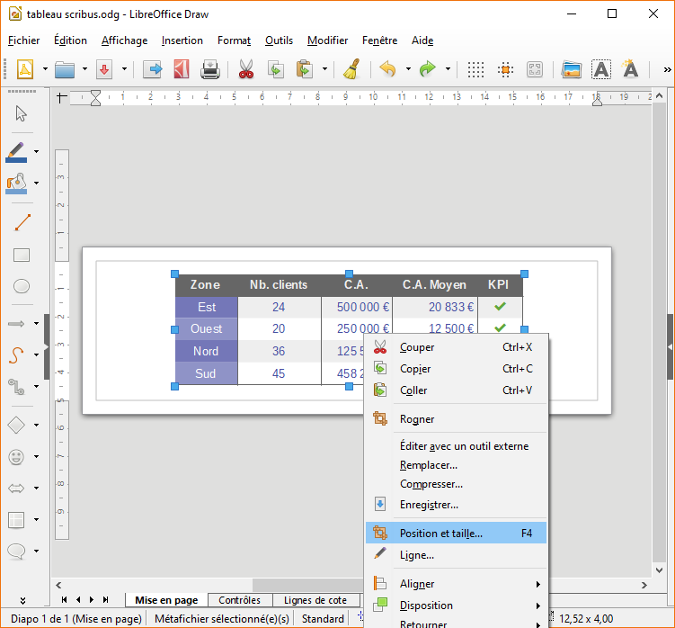

Gardez bien les proportions du tableau pour ne pas le déformer.

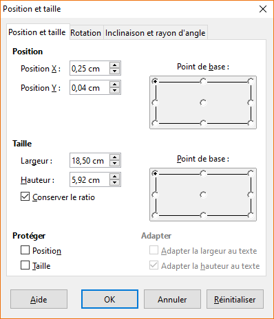

On termine par l'alignement centré en hauteur et en largeur du tableau dans le document.

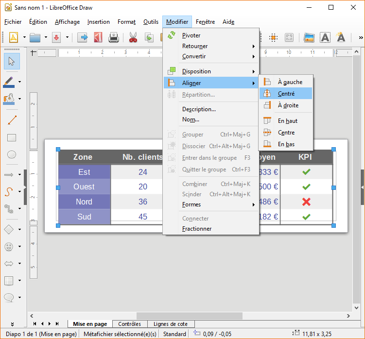

Maintenant que l'ensemble est bien calé, pensez bien à sauvegarder votre document.
Nous allons maintenant exporter notre document pour pouvoir l'intégrer dans Scribus.

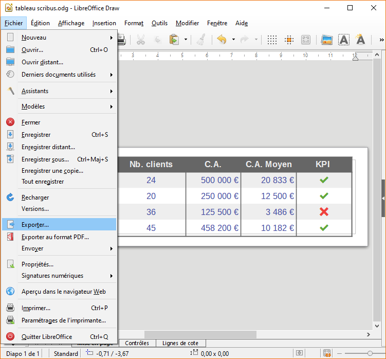

Dans la fenêtre d'exportation, il faut choisir le format EPS ce qui permet de garder des éléments vectoriels qui pourront être transformés sous Scribus sans perte de qualité.

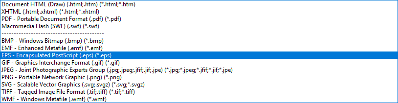

Voici les paramètres à configurer pour l'export EPS

Intégration du Fichier EPS dans Scribus
---------------------------------------

Pour finir, ouvrez Scribus avec un document vide ou le document en cours de création de votre choix. Allez dans le menu Fichier &gt; Importer &gt; Importer un fichier vectoriel

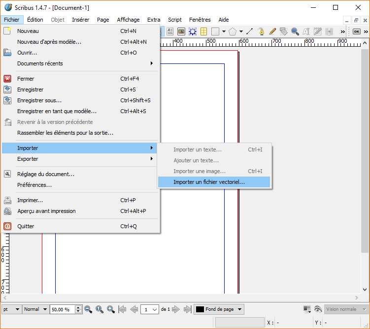

Cliquez à l'endroit où vous désirez intégrer le tableau. Celui-ci va apparaître dans votre document avec la même mise en page que sous Calc.

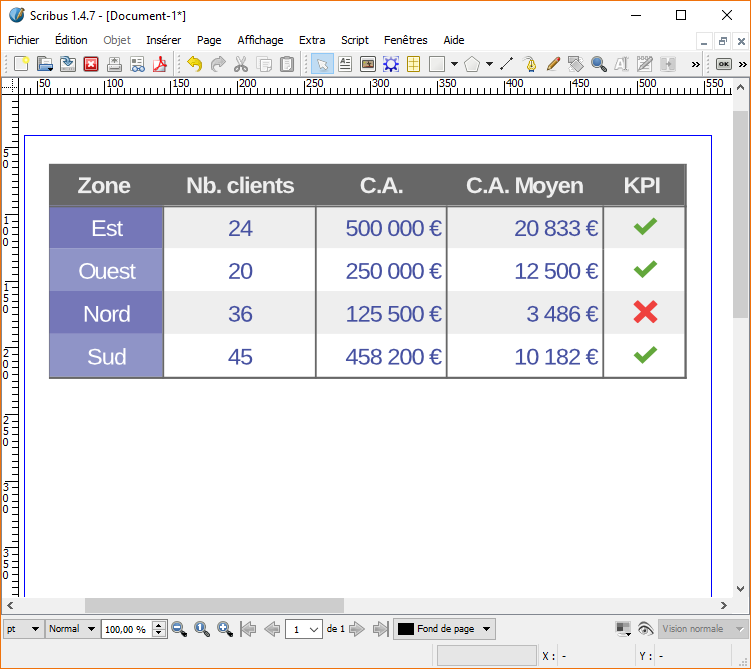

Comme c'est un format vectoriel, vous pouvez modifier sa taille sous Scribus sans perte de qualité. Vous pouvez également éclater l'ensemble de ses éléments avec la fonction dégrouper pour modifier tout ce que vous voulez.

source : 

- <https://www.opensolus.fr/news/tutoriel/tuto-integrer-tableau-dans-scribus/>

---

*[OpenSolus &reg;](https://opensolus.fr) - juin 2018 - v1.1*
